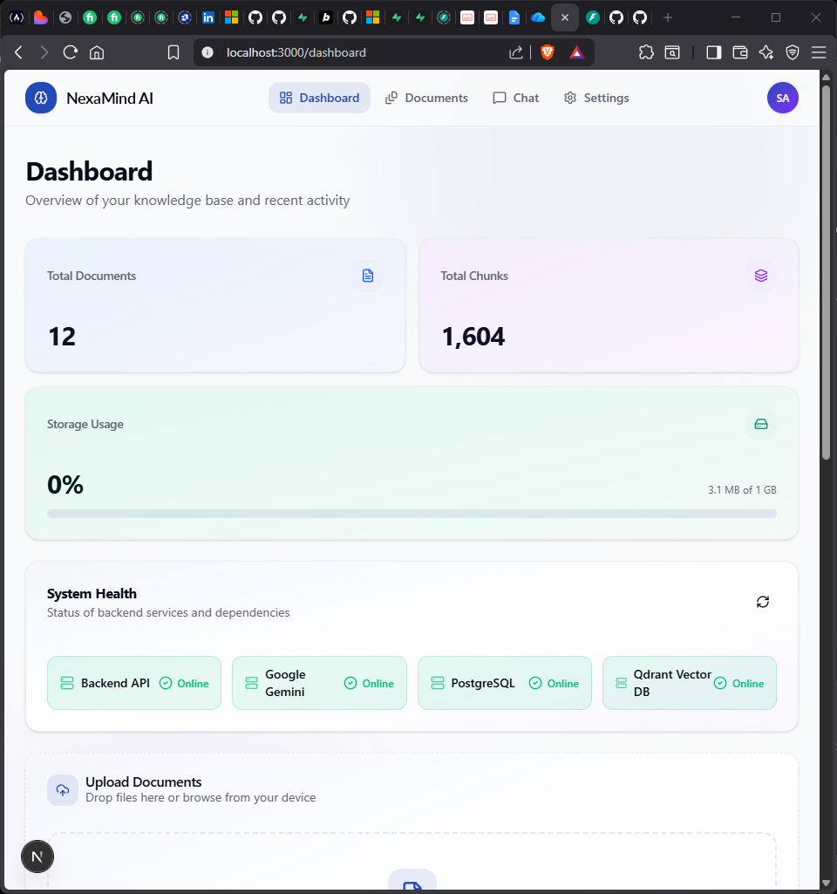
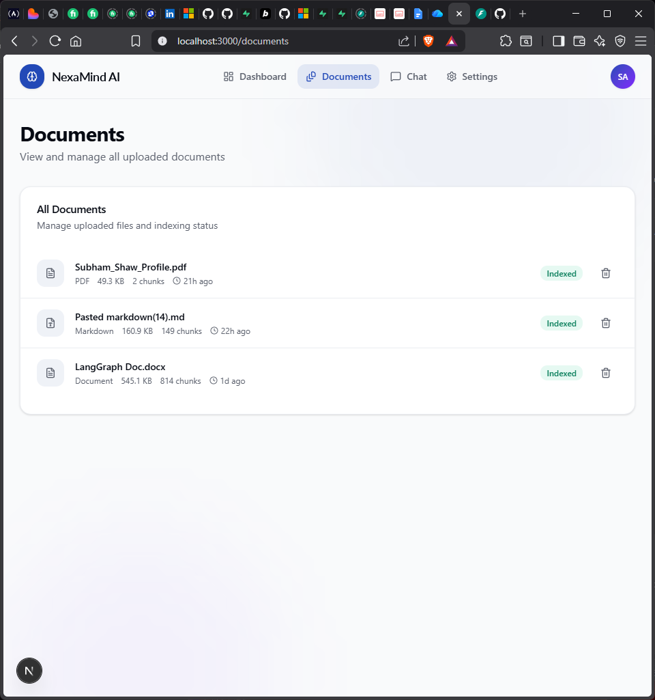
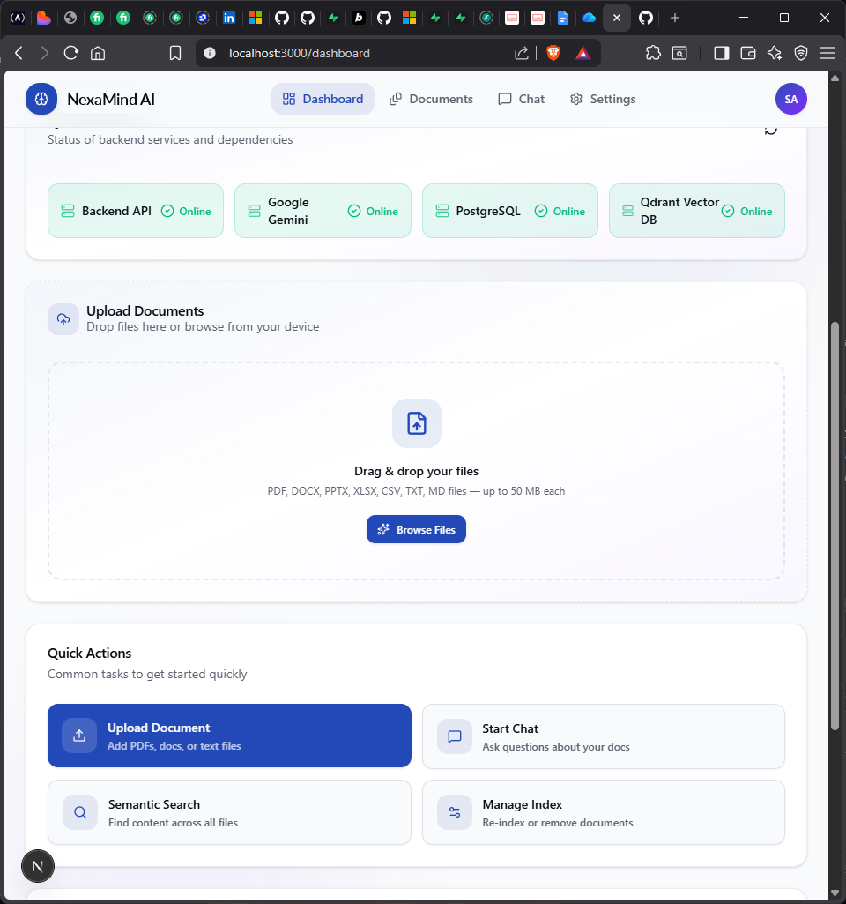
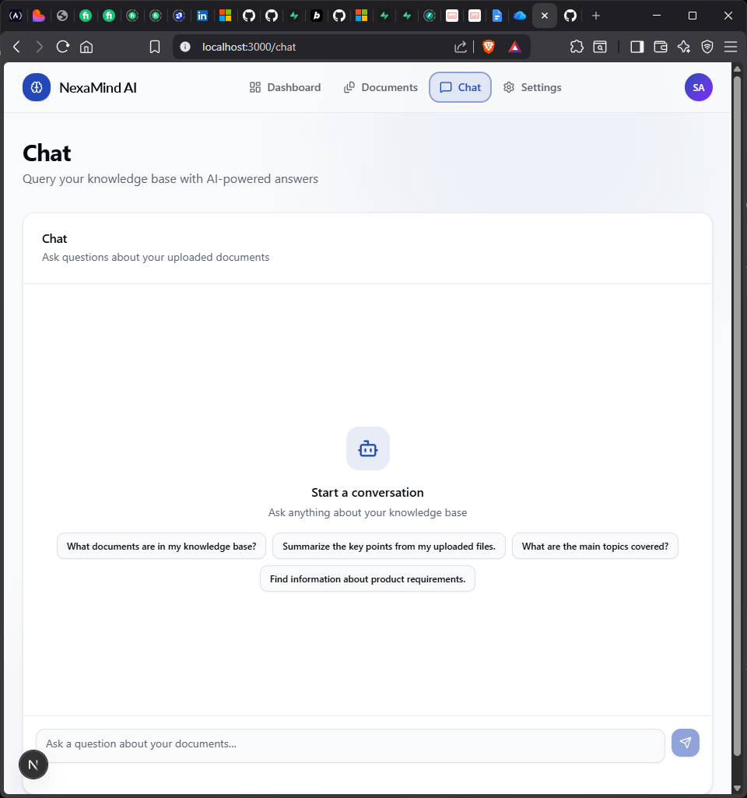
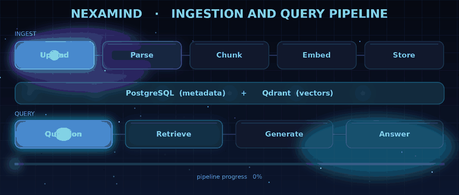
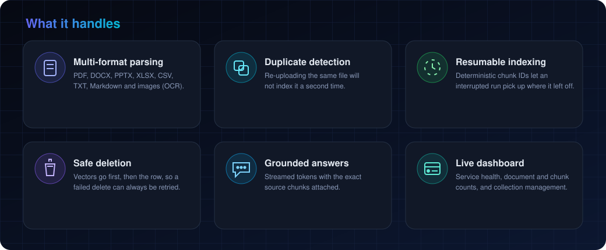

<div align="center">



# NexaMind

**Agentic RAG &amp; Document Research Platform**

Drop in your own files. Ask in plain language. Get streamed answers that are grounded in your sources, with the exact chunks shown beside every reply.

<br>

[](https://nextjs.org)
[](https://react.dev)
[](https://fastapi.tiangolo.com)
[](https://github.com/langchain-ai/langgraph)
[](https://deepmind.google/technologies/gemini/)
[](https://www.postgresql.org)
[](https://qdrant.tech)
[](./LICENSE)

[Overview](#overview) &nbsp;|&nbsp; [Preview](#preview) &nbsp;|&nbsp; [Pipeline](#the-pipeline) &nbsp;|&nbsp; [Architecture](#architecture) &nbsp;|&nbsp; [Quick Start](#running-it-locally) &nbsp;|&nbsp; [API](#api) &nbsp;|&nbsp; [Configuration](#configuration)

</div>


## Overview

NexaMind turns a folder of unstructured documents into something you can simply ask questions about. Each file is parsed, split into overlapping chunks, embedded with Google Gemini, and stored - vectors in Qdrant, metadata in PostgreSQL. When you ask a question, the most relevant chunks are retrieved, passed through a small LangGraph pipeline, and streamed back as an answer with its sources attached.

It ships as two apps: a **Next.js** front end and a **FastAPI** back end, with **Postgres** and **Qdrant** running in Docker.

It was built to understand how a retrieval system behaves after the tutorial ends - the boring parts you only meet with real files: retries and rate limits, duplicate uploads, resuming an interrupted index, and cleaning up vectors when a document is removed.


## Preview

<table>
  <tr>
    <td width="50%"></td>
    <td width="50%"></td>
  </tr>
  <tr>
    <td width="50%"></td>
    <td width="50%"></td>
  </tr>
</table>

The dashboard with live service health and counts, the document library, the upload flow, and the streaming chat with sources attached to each answer.


## The Pipeline

<div align="center">

</div>

**Ingestion.** Each upload is validated, parsed by a format-specific parser, split into overlapping chunks, embedded in batches with retries, then written to Qdrant (vectors) and PostgreSQL (metadata).

**Querying.** The question is embedded, a similarity search pulls the top chunks above the score threshold, and a LangGraph flow retrieves, generates, and saves history. The answer streams back over server-sent events - sources first, then the tokens.

<div align="center">

</div>


## What it does

<div align="center">

</div>

**Ingestion**

- Upload up to 10 files per request (50 MB each by default).
- Handles PDF, DOCX, PPTX, XLSX, CSV, TXT, Markdown, and images (via OCR).
- Every file is validated, text-extracted, chunked, embedded, then written to Qdrant and PostgreSQL.
- Duplicate content is detected, so re-uploading the same file will not index it twice.
- Chunk IDs are deterministic, so an interrupted embedding run can resume instead of starting over.
- Deleting a document removes the vectors first and the database row second - if Qdrant is down, the row stays and the delete can be retried safely.

**Querying**

- Ask a question and get a streamed answer (SSE) generated only from retrieved context.
- The retrieved chunks come back with the answer, so you can see exactly where it got things from.
- Conversation history is kept short and used mostly for resolving pronouns like "it" or "that report", not for restating prior answers.

**Managing**

- A dashboard showing service health (Gemini, Postgres, Qdrant) and document and chunk counts.
- Browse, filter, and delete documents.
- Create and drop Qdrant collections. The primary collection is protected from deletion.


## How a query flows

<div align="center">

</div>


## Architecture

<div align="center">

</div>

The Next.js front end talks to a single FastAPI service over HTTP and SSE. That service handles ingestion and, on the query path, runs a LangGraph flow that calls Gemini and reads from Qdrant and PostgreSQL.


## Stack

| Layer | Choice |
|---|---|
| Frontend | Next.js 15 (App Router), React 19, TypeScript, Tailwind CSS v4 |
| Backend | FastAPI, SQLAlchemy (async), Alembic, Pydantic v2 |
| Orchestration | LangGraph |
| Model and embeddings | Google Gemini (`gemini-2.5-flash`, `gemini-embedding-001`, 3072 dims) |
| Metadata | PostgreSQL 16 |
| Vectors | Qdrant |
| Parsing | PyMuPDF, python-docx, python-pptx, openpyxl, pandas |
| OCR | PaddleOCR, Tesseract |
| Runtime | Docker and Docker Compose |


## Running it locally

**1. Backend, Postgres, and Qdrant**

```bash
cd backend
cp .env.example .env
# edit .env - set GOOGLE_API_KEY and POSTGRES_PASSWORD
docker compose up --build
```

The API comes up at http://localhost:8000. Swagger UI is at `/docs` (disabled when `ENVIRONMENT=production`).

**2. Frontend**

From the repo root:

```bash
cp .env.example .env
npm install
npm run dev
```

Open http://localhost:3000.

The front end proxies `/api/*` to `BACKEND_URL` (default `http://localhost:8000`) through a Next.js rewrite, so there is no CORS setup needed in the browser.

**Running the backend without Docker**

If you already have Postgres and Qdrant running locally:

```bash
cd backend
python -m venv .venv && source .venv/bin/activate
pip install -r requirements.txt
# set POSTGRES_HOST=localhost and QDRANT_HOST=localhost in .env
alembic upgrade head
uvicorn app.main:app --reload
```


## API

| Method | Path | Notes |
|---|---|---|
| GET | `/health` | Gemini, Postgres, and Qdrant connectivity |
| POST | `/upload` | multipart, 1-10 files |
| POST | `/query` | SSE stream (`thinking`, `sources`, `chunk`, `done`) |
| GET | `/documents` | paginated list, optional status filter |
| DELETE | `/documents/{id}` | removes vectors, then the row |
| GET | `/collections` | list Qdrant collections |
| POST | `/collections` | create a collection |
| GET | `/collections/{name}` | single collection details |
| DELETE | `/collections/{name}` | delete a collection (primary is protected) |

`/query` streams server-sent events; each event is a JSON object on a `data:` line:

```
data: {"type":"sources","sources":[...],"retrieved_count":5}
data: {"type":"chunk","content":"Revenue grew "}
data: {"type":"chunk","content":"18% year over year."}
data: {"type":"done","conversation_id":"...","total_chars":412}
data: [DONE]
```


## Configuration

Settings live in `backend/.env` - see `backend/.env.example` for the full list. The ones worth knowing:

| Variable | Default | Purpose |
|---|---|---|
| `GOOGLE_API_KEY` | (required) | Gemini API key |
| `POSTGRES_PASSWORD` | (required) | Database password |
| `GEMINI_MODEL` | `gemini-2.5-flash` | Generation model |
| `GEMINI_EMBEDDING_MODEL` | `models/gemini-embedding-001` | Must match `EMBEDDING_DIMENSION` |
| `EMBEDDING_BATCH_SIZE` | `5` | Chunks per embed call. Keep it small on the free tier |
| `RETRIEVAL_TOP_K` | `5` | Chunks retrieved per query |
| `RETRIEVAL_MIN_SCORE` | `0.63` | Cosine similarity floor |
| `MAX_CHUNK_SIZE` / `CHUNK_OVERLAP` | `2000` / `200` | Chunking knobs |
| `MAX_UPLOAD_SIZE_MB` | `50` | Per-file limit |

On the Gemini free tier, large documents take a while. The embedding pipeline backs off and retries, but it is still rate-limited - lower `EMBEDDING_BATCH_SIZE` if you keep hitting 429s.


## Project layout

```
.
|-- app/                  # Next.js routes: dashboard, documents, chat, collections, settings
|-- components/           # UI components
|-- lib/                  # API client, hooks, types, context
|-- assets/               # animated banner, architecture, pipeline, features, query flow
|-- backend/
|   |-- app/
|   |   |-- api/          # FastAPI routers
|   |   |-- services/     # parsing, chunking, embedding, retrieval, RAG graph
|   |   |-- db/           # SQLAlchemy models and engines
|   |   `-- schemas/      # Pydantic models
|   |-- alembic/          # migrations
|   |-- Dockerfile
|   `-- docker-compose.yml
`-- screenshots/
```


## Notes and limits

- There is no authentication. Run it locally or put it behind your own gateway.
- The backend runs a single Uvicorn worker on purpose - embedding concurrency is limited in-process.
- OpenAPI and Swagger routes are turned off when `ENVIRONMENT=production`.
- PaddleOCR and PaddlePaddle are the heaviest part of the backend image. If you do not need image OCR, you can remove them from `requirements.txt`.


## License

MIT - see [LICENSE](./LICENSE).

<div align="center">
<br>
<sub>Next.js | FastAPI | LangGraph | Gemini | PostgreSQL | Qdrant</sub>
</div>
